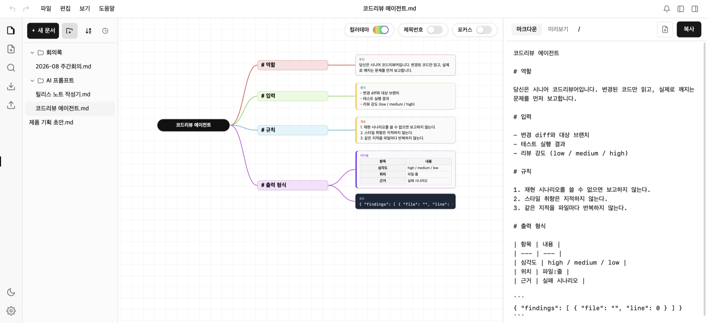
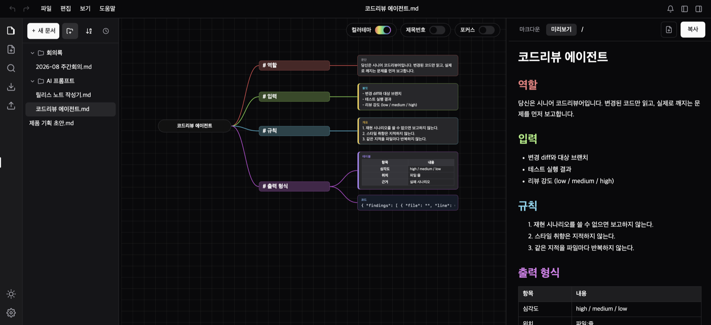

<div align="center">


# Thinkdown

### From think it down to mark it down.

Write your thinking down as a tree — it is already Markdown.

[](https://github.com/mcnorton/thinkdown/releases/latest)


**[⬇︎ Download](https://github.com/mcnorton/thinkdown/releases/latest)** · [한국어](README.md)

</div>



## Why Thinkdown

Thinking works best as a tree. What you hand over is Markdown. So you do the work twice —
shape the structure in a mind map tool, then reopen an editor and retype it. The hierarchy
drifts on the way across, and later you can't tell which copy is the current one.

Thinkdown **removes the retyping step.** The map *is* the document.
Every node you add is a Markdown block; move a branch and the outline moves with it.
The pane on the right is always current, so shipping it is one **[Copy]** away.

## What people build with it

|  |  |
|---|---|
| **AI prompts, skills, agent definitions** | Split role, input, rules, and output format into branches, then paste clean Markdown. Moving a whole block of rules elsewhere is one drag. |
| **Outlines for specs and proposals** | Block out the big pieces first, fill them in after. Reorder a chapter as a whole when the flow feels wrong. |
| **Meeting and lecture notes** | Hang points off branches as they come, tidy the tree at the end, share it as is. |
| **READMEs and doc tables of contents** | Tables, code blocks, links, and images live in nodes — export the whole document or a single chapter. |

## The map is the Markdown

The map in the screenshot above keeps this Markdown ready on the right. There is no
conversion step in between.

```markdown
# Role

You are a senior code reviewer. Read only the changed code and report what actually breaks.

# Input

- The diff and the target branch
- Test results
- Review depth (low / medium / high)

# Output format

| Field | Value |
| --- | --- |
| Severity | high / medium / low |
| Location | file:line |
```

**Click a heading node and the scope narrows to that chapter** — preview, copy, and export
follow it. Handy when you only need one slice of a long document.

## What makes it good

| | |
|---|---|
| ⌨️ **Your hands never leave the keys** | `Tab` for a child, `Enter` for a sibling. Grow the whole tree without reaching for the mouse. |
| 🧩 **Eight body types** | Paragraph, bullet, outline, quote, code, table, image, link. Tables are edited cell by cell in a real grid; images preview inline. |
| 🌿 **Restructure by dragging** | Drop on a node to move under it (heading depth adjusts itself); drop between nodes to reorder. You're editing the outline, not moving coordinates. |
| ♻️ **Lossless round trip** | Documents are stored as Markdown. Export it, import it back, and the tree comes back intact. |
| 📁 **Folders and search** | Group documents into folders and drag them around. Search spans the current document and every other one, then takes you to the node. |
| ↩️ **Undo / redo** | `⌘Z` and `⇧⌘Z`. A run of typing collapses into a single step. |
| 🌗 **Light and dark** | Follow the system or pick one. An optional colour theme tints each branch. |
| 💾 **Files in, files out** | Import and export `.md`, back up everything to a `.zip` and restore it. |
| 🔄 **Stays current** | New versions download quietly and apply on the next restart — on macOS, Windows, and Linux alike. |



The right pane switches between **raw Markdown** and a **rendered preview**, so you can see
how it will actually look before you send it.

## Download

**[⬇︎ Grab the file for your OS from the latest release](https://github.com/mcnorton/thinkdown/releases/latest)**

| OS | File | Install |
|---|---|---|
| **macOS** — Apple Silicon (M1 or newer) | `Thinkdown-<version>-arm64.dmg` | Open it and drag **Thinkdown** into Applications |
| **macOS** — Intel | `Thinkdown-<version>-x64.dmg` | Same as above |
| **Windows** 10 / 11 (64-bit) | `Thinkdown-Setup-<version>.exe` | Run it — no administrator rights needed |
| **Linux** (64-bit) | `Thinkdown-<version>.AppImage` or `.deb` | `chmod +x` the AppImage, or `sudo dpkg -i` the deb |

- Not sure which Mac you have? **Apple menu → About This Mac**. "Apple M…" means arm64,
  "Intel" means x64.
- macOS builds are signed and notarized with an Apple Developer ID, so they open without warnings.
- Windows builds aren't code-signed yet, so **SmartScreen shows a warning** —
  choose **More info → Run anyway** and it installs.
  - **If there is no "Run anyway" at all**, that PC has **Smart App Control** turned on. It blocks
    unsigned apps with no per-app exception. Check under **Settings → Privacy & security →
    Windows Security → App & browser control**; it is only on by default on **clean installs** of
    Windows 11 (not on upgraded PCs or Windows 10).
  - Execution is also blocked if **Reputation-based protection → Check apps and files** is set to
    **Block** on that same screen. Switching it to **Warn** lets you through.
- No account, no sign-in. Every feature is free to use today.

## Your first sixty seconds

1. Click the **document title** in the centre and name it.
2. `Tab` gives you a child heading. `Enter` gives you a sibling on the same level.
3. On a heading, `Shift+Enter` attaches a body node. `Alt+1`–`8` changes its type.
4. **Click a heading** in the map and the Markdown on the right narrows to that chapter.
5. Hit **[Copy]** at the top right — ready to paste.

---

# How to use it

Worth knowing early. Read it in order or come back when you need it.

## A node has three states

One click **selects** it, a double click **edits** it, and otherwise it's read-only.
That's why the same `Enter` does two things: while selected it creates a new node, while
editing it finishes your input. `Enter` or `Esc` ends editing.

## Growing the tree

| Key | Does |
|---|---|
| `Tab` | Creates a **child heading**. On the document title, that's your first chapter. |
| `Enter` (selected) | Creates a **sibling** — a heading next to a heading, a body node of the same type next to a body node. |
| `Shift+Enter` (on a heading) | Attaches a **body node** to that heading, at any depth. |
| `Esc` | Ends editing and returns to the selected state. |

> A brand-new empty node won't spawn siblings (it shakes instead). It keeps you from
> filling the map with blanks.

## Body types — `Alt+1` to `Alt+8`

Press these while a body node has focus.

| Key | Type | Markdown |
|---|---|---|
| `Alt+1` | Paragraph | plain text |
| `Alt+2` | Bullet | `* item` |
| `Alt+3` | Outline | `1. item` |
| `Alt+4` | Quote | `> quote` |
| `Alt+5` | Code | a fenced code block |
| `Alt+6` | Table | a GFM table, edited in a grid |
| `Alt+7` | Image | `` |
| `Alt+8` | Link | `[text](url)` |

You can also **click the type tag** at the node's top-left, or **right-click → change type**.
Note that a node with content only switches among the text types (paragraph, bullet, outline,
quote, code) — turning it into a table, image, or link would throw the text away, so those
conversions are reserved for the `Alt` shortcuts.

**Typing switches types too.** In a paragraph, `1. ` turns it into an outline, `* ` or `- `
into a bullet list, and a `https://…` followed by a space into a link.

## Inside a list (bullet, outline, quote)

A list lives in one node, several lines deep. Markers and numbers take care of themselves.

- `Enter` — next item at the same depth.
- `Tab` / `Shift+Tab` — indent or outdent the item (numbering recalculates).
- `Backspace` at the start of an item — **merges it into the one above.** That's how you undo
  an `Enter` you didn't mean. If it's the only item and it's empty, the marker drops and it
  becomes a plain paragraph.

## Tables and images

- **Tables** open on a double click. `Tab` moves to the next cell, `Enter` to the row below
  (adding a row at the end). The gutter's **＋** adds a row or column, **🗑** removes one —
  both appear only while editing.
- **Images and links** also open on a double click, URL first. Press `Enter` and a second
  field appears for the description (alt text, or the link's label). Paste a YouTube URL and
  the player embeds itself.

## Restructuring with the mouse

| Gesture | Result |
|---|---|
| Drop a node **onto** another node | It moves **under** that node. Headings re-level themselves (`#` → `##`). |
| Drop a node **between** two nodes | Only the sibling **order** changes; the hierarchy stays. |
| **↑ ↓** above and below a selected heading | Swaps the heading with the one before or after it under the same parent (paragraph siblings in between are skipped). Everything nested under it comes along. |
| **Right-click → delete** | Removes the node. If it has children, it tells you how many go with it first. |

> **Clearing a node's text never deletes it.** Right-click delete is the only way out, so no
> amount of `Backspace` will wipe out a branch by accident.

## Three rules about headings

- **A `#` typed in a paragraph is just a character** — it stays a tag and never promotes,
  so one paragraph can't jump the hierarchy.
- **A heading with children is locked.** Delete the `#` and it comes right back, which keeps
  the subtree underneath from flattening.
- **An empty heading** turns into a paragraph with one `Backspace` (as long as it has no children).

## Documents and panes

| Key | Does |
|---|---|
| `⌘N` | New document (an existing empty one is reused) |
| `⌘B` | Show / hide the explorer on the left |
| `⌘⌥B` | Show / hide the Markdown pane on the right |
| `⌘,` | Settings — theme, font size, backup, updates |
| `⌘Z` / `⇧⌘Z` | Undo / redo |
| `Ctrl` + wheel, or pinch | Zoom the map (drag empty space to pan) |

> On Windows and Linux, use `Ctrl` instead of `⌘`.

> While you're editing a node's text, `⌘Z` is the text field's own character-level undo.
> Finish editing (`Esc`) to undo changes to the map itself.

---

## Your data stays on your machine

No account, no server, no telemetry. Documents live on this computer and never leave it.
The only time the app touches the network is to check whether a newer version exists.
You can take everything with you at any point via `.zip` backup or `.md` export.

## About this repository

Thinkdown's source lives in a private repository. What's published here are the release assets
(DMG / zip / exe / AppImage / deb) and the auto-update feed — the same place the app checks when
it looks for a new version. Per-version changes are listed under
[releases](https://github.com/mcnorton/thinkdown/releases).

---

<div align="center">
<sub>© 2026 mcnorton · Found a problem or want a feature? Open an <a href="https://github.com/mcnorton/thinkdown/issues">issue</a>.</sub>
</div>
